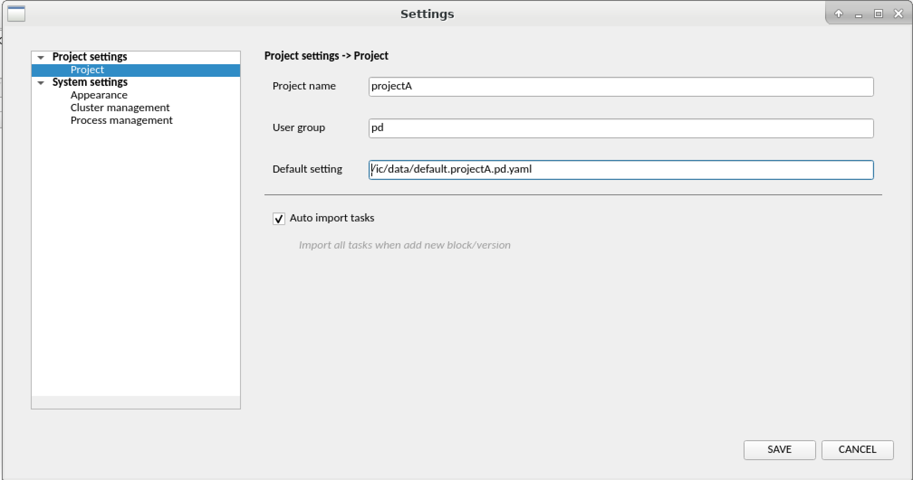
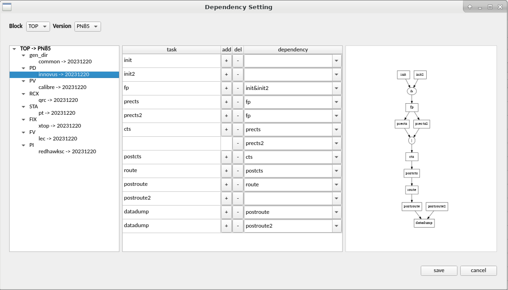
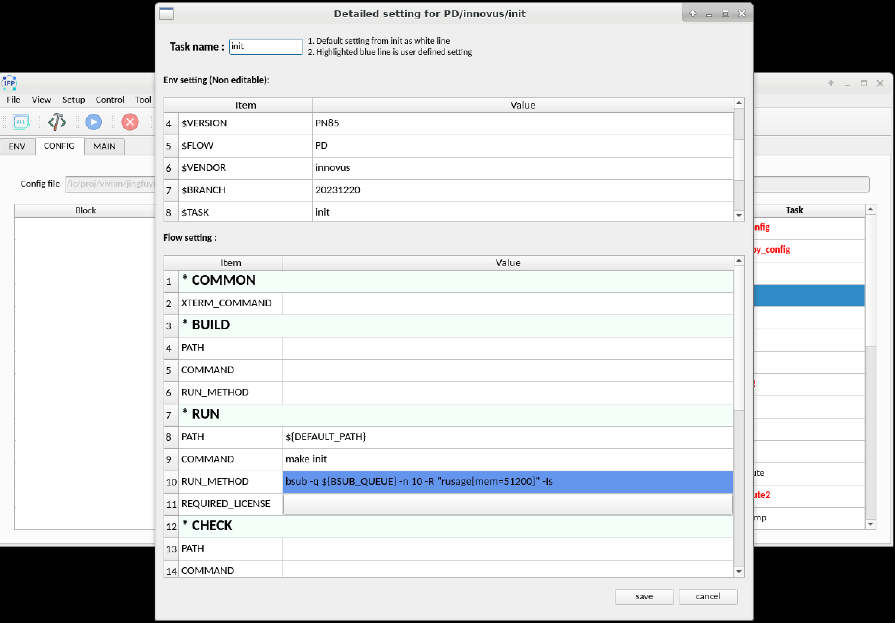
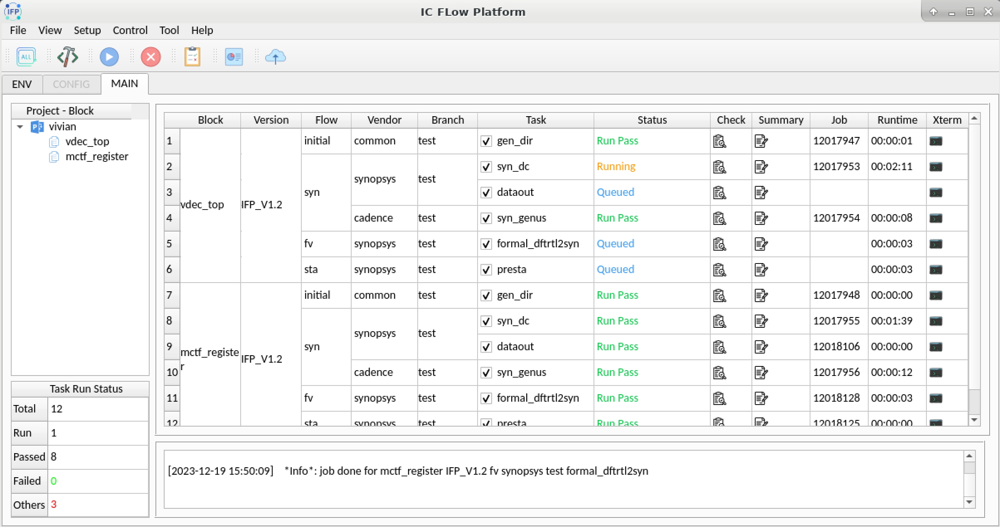

# IC Flow Platform V1.2 (2023.12.31)

## Update history
  
|Version |Date            | Update content      |
| :-----------| :-----------| :-----------------  |
| V1.2   |(2023.12.31)    | Support more complex logic control and centrally manage user settings |
| V1.1.1 |(2023.08.31)    | Optimize menu bar functions and interface operations|
| V1.1   |(2023.07.14)    | Fix some operation bugs and optimize CONFIG TAB operation mode
| V1.0   |(2023.02.02)    | Open source and the first official version is released

## Introduction

### 0. What is IFP?

IFP (ic flow platform) is an integrated circuit design
flow platform, mainly used for IC process specification
 management and data flow control.

### 1. Python dependency
Need python3.8.8, Anaconda3-2021.05-Linux-x86_64.sh is better.
Install python library dependency with command

    pip install -r requirements.txt

### 2. Install
Copy install package into install directory.
Execute below command under install directory.

    python3 install.py

### 3. Administrator configs default settings for user
  - $IFP_INSTALL_PATH/config/config.py : default user configuration for IFP
  - $IFP_INSTALL_PATH/config/default.yaml : default task action attribute
  - $IFP_INSTALL_PATH/config/env.* : default user environment setting

### 4. Run IFP

  - Step 1 : Create working path and enter into the directory
  - Step 2 : Execute $IFP_INSTALL_PATH/bin/ifp to run IFP with GUI mode
  - Step 3 : Open menubar `Setup > Settings` to choose default setting and update personalizations
  

  
  - Step 4 : Open menubar `Setup > Set Dependency` to define task actuating logic
  
  
  
  - Step 5 : Create your tasks in `CONFIG TAB` and adjust task detailed settings
  
  
  
  - Step 6 : Execute actions and monitor the progress in `MAIN TAB`
  

  
  
More details please see ["docs/IFP_user_manual.pdf"](./docs/IFP_user_manual.pdf)
