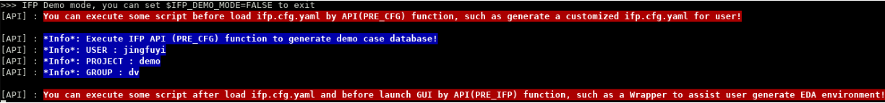
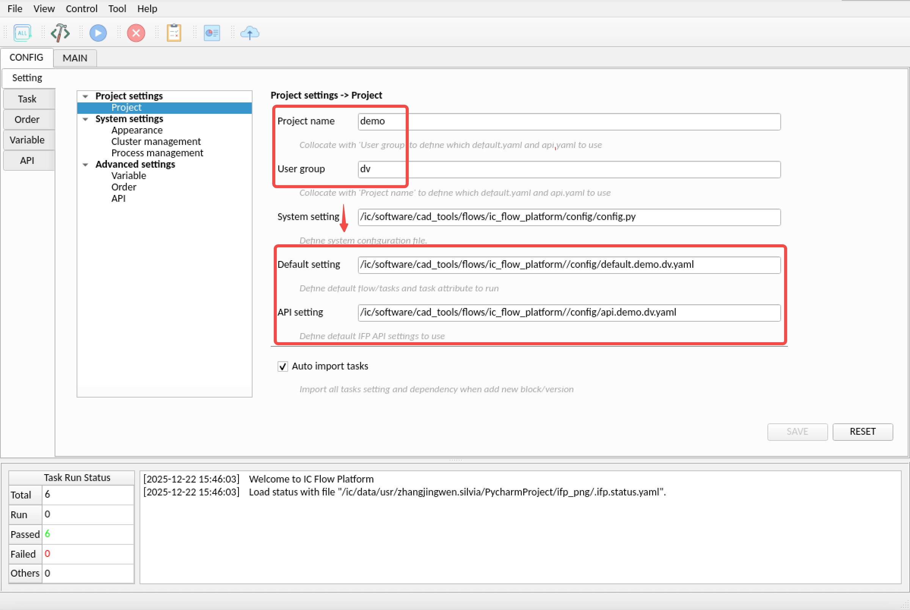
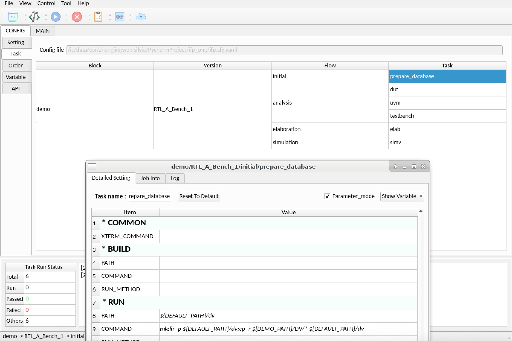
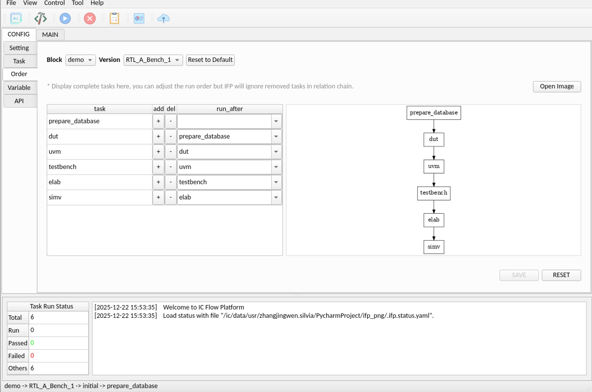
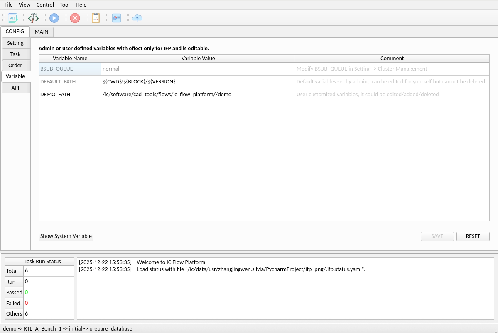
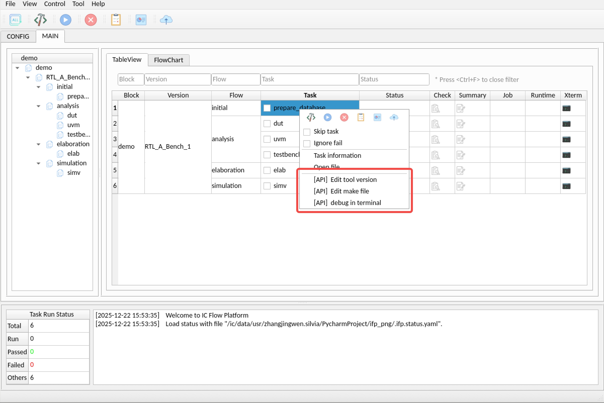
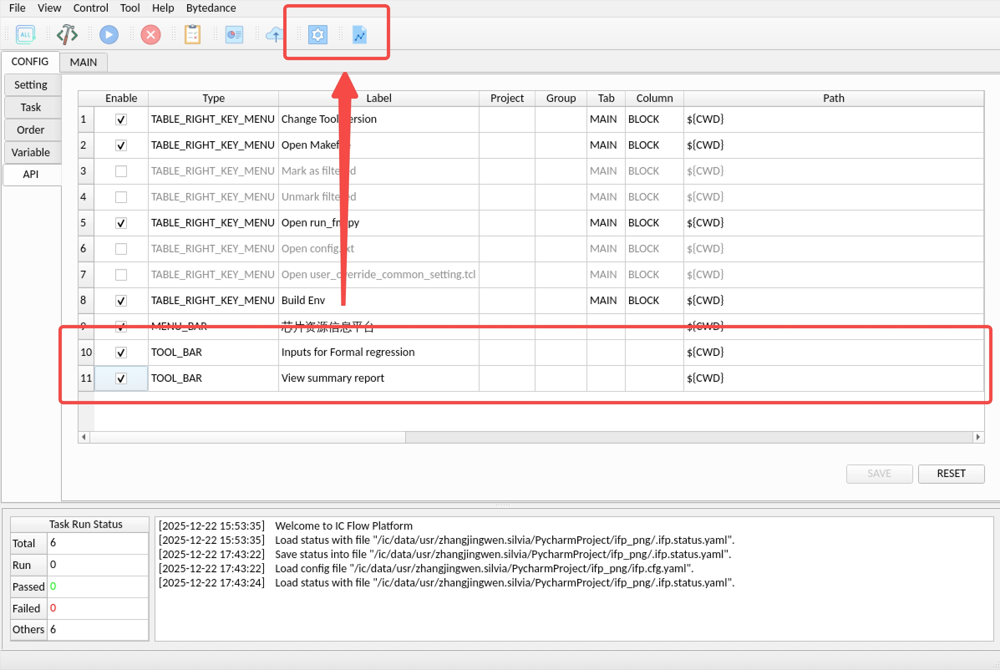
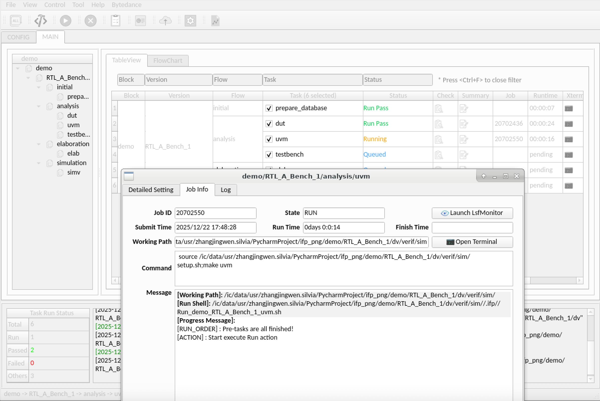
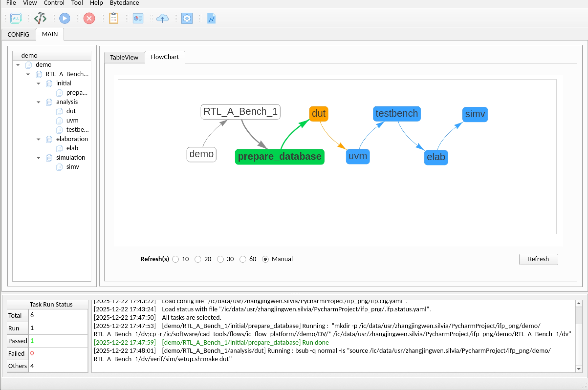

# IC Flow Platform V1.4.3 (2024.12.10)

> V1.4 is not compatible with previous version due to removed vendor/branch and new format default.yaml

## Update history
***
| Version | Date         | Update content                                                                                                                                                                                                                                                                                                                                                     |
|:--------|:-------------|:-------------------------------------------------------------------------------------------------------------------------------------------------------------------------------------------------------------------------------------------------------------------------------------------------------------------------------------------------------------------|
| V1.4.3  | (2025.12.10) | Optimize task management mechanism with separated GUI and execution logic. Improve configuration loading speed and page rendering performance Add user operation logging and task submission records,  Add configuration update notifications and Support multiple Log configurations for Task Fix several bugs and optimize memory/process management |
| V1.4.2  | (2025.05.25) | Add IN_PROCESS_CHECK to execute check when task running  Add filter function   Support set $MAX_RUNNING_JOBS   Support export IFP data for secondary development                                                                                                                                                                                       |
| V1.4.1  | (2025.02.28) | Add RUN_MODE to switch command for specific task  Support Menubar and Toolbar API  Add launch parameter -t for title and -r for read_only mode                                                                                                                                                                                                             |
| V1.4    | (2024.11.30) | Remove vendor and branch columns More detailed task information interface More clearly method to define task attributes/run order/dependency in default.yaml                                                                                                                                                                                               |
| V1.3.1  | (2024.09.04) | Support edit and export default.yaml / api.yaml from GUI  Add syn demo case in user guidance                                                                                                                                                                                                                                                                   |
| V1.3    | (2024.07.15) | Brand new user configuration interface and API function to support customized daily work scenarios                                                                                                                                                                                                                                                                 |
| V1.2    | (2023.12.31) | Support more complex logic control and centrally manage user settings                                                                                                                                                                                                                                                                                              |
| V1.1.1  | (2023.08.31) | Optimize menu bar functions and interface operations                                                                                                                                                                                                                                                                                                               |
| V1.1    | (2023.07.14) | Fix some operation bugs and optimize CONFIG TAB operation mode                                                                                                                                                                                                                                                                                                     |
| V1.0    | (2023.02.02) | Open source and the first official version is released                                                                                                                                                                                                                                                                                                             |

## Introduction
***

### 0. What is IFP?

IFP (ic flow platform) is an integrated circuit design
flow platform, mainly used for IC process specification
 management and data flow control.

### 1. Python dependency
Need python3.8.8, Anaconda3-2021.05-Linux-x86_64.sh is better.
Install python library dependency with command

    pip install -r requirements.txt

### 2. Install
Copy install package into install directory.
Execute below command under install directory.

    python3 install.py

### 3. Administrator configs default settings for user
  - ${IFP_INSTALL_PATH}/config/config.py : default system configuration
  - ${IFP_INSTALL_PATH}/config/default.yaml : default flow/task and corresponding action attribute (Main flow, can be distinguished by project and user group)
  - ${IFP_INSTALL_PATH}/config/api.yaml : default API setting (Customized functions to support daily work and can be distinguished by project and user group too)
  - ${IFP_INSTALL_PATH}/config/env.* : default user environment setting

### 4. Demo case
IFP will enter demo mode when you set ${IFP_DEMO_MODE}=TRUE, such as (bash env):

    export IFP_DEMO_MODE=TRUE

### 5. Run IFP

  - Step 1 : Create working path and enter into the directory
  - Step 2 : Execute ${IFP_INSTALL_PATH}/bin/ifp to run IFP with GUI mode
  - Step 3 : Enter `Project_name` and `User_group` in `CONFIG-Setting interface` to match admin's default flow setting and API setting

  - Step 4 : Create your tasks in `CONFIG-Task interface` and adjust task detailed settings

  - Step 5 : Adjust task actuating logic in `CONFIG-Order interface`, if you select `Enable user order interface`

  - Step 6 : Adjust IFP internal variables in `CONFIG-Variable interface`, if you select `Enable user variable interface`

  - Step 7 : Enable/Disable API functions in `CONFIG-API interface`, if you select `Enable user API interface`

  - Step 8 : Execute actions and monitor the progress in `MAIN interface`

  - Step 9: Navigate to the FlowChart tab in `MAIN interface` or select version and choose `Show Flow Chart`

More details please see ["docs/IFP_user_manual.pdf"](./docs/IFP_user_manual.pdf) and ["docs/IFP_admin_manual.pdf"](./docs/IFP_admin_manual.pdf)
