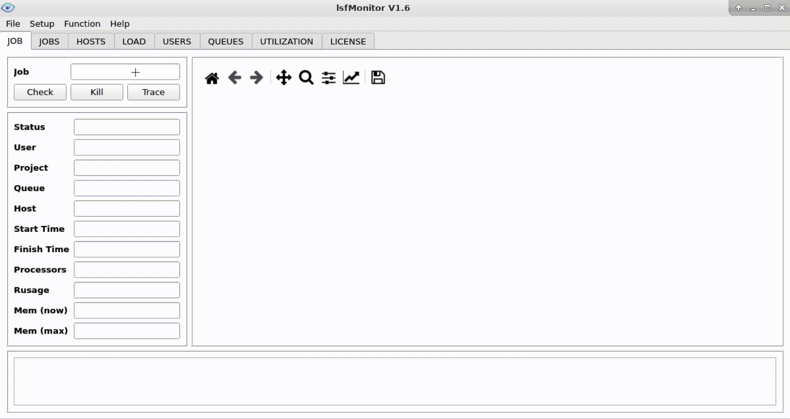
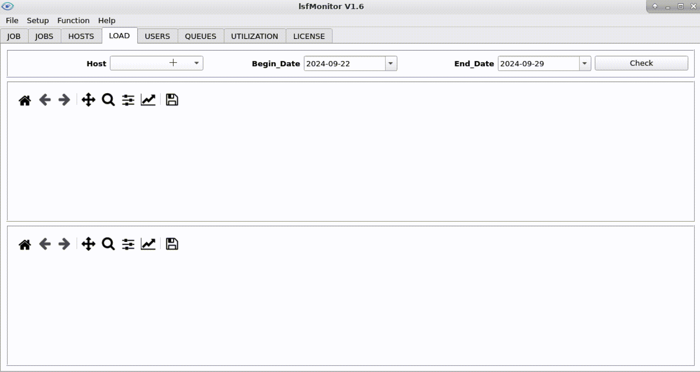
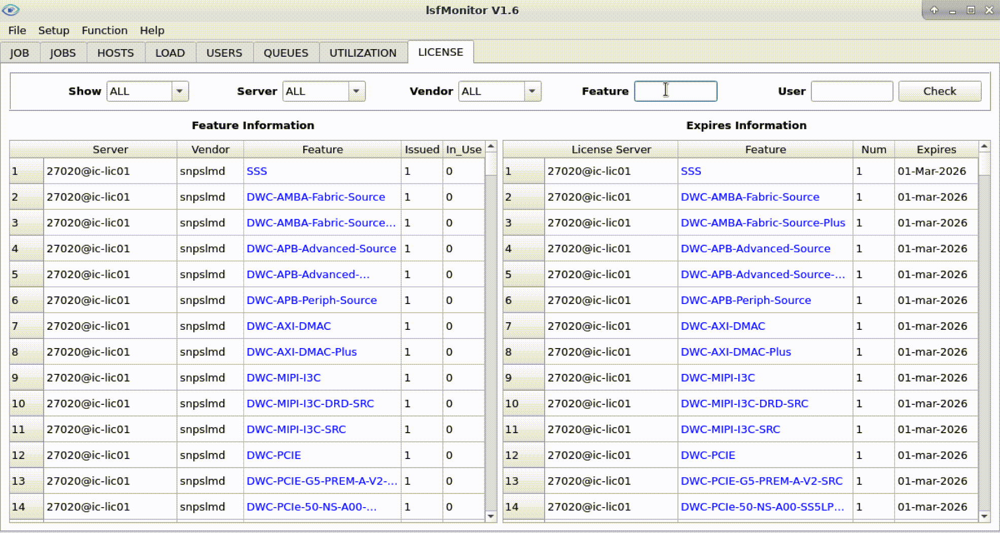

**Author:** liyanqing1987@163.com    
**Version:** V1.6

## What’s lsfMonitor?
`lsfMonitor` is an open source software for LSF information data-collection,
data-analysis and data-display.

## Python dependency
Need python3.8.8, Anaconda3-2021.05-Linux-x86_64.sh is better.    
Install python library dependency with command    

    pip install -r requirements.txt

## Install
Copy install package into install directory.    
Execute below command under install directory.    

    python3 install.py

## Quick start
Execute command `bmonitor` to start lsfMonitor.    
* Below is a demo on how to track job status.    

   

* Below is a demo on how to view server load information.

   

* Below is a demo on how to search license feature usage information.

   

## Configuration
After installing the tool, come into <LSFMONITOR_INSTALL_PATH>/monitor/conf directory,
then update file config.py for your own configuration.

    db_path = ""
    lmstat_path = ""
    lmstat_bsub_command = ""

"db_path" is used to save database files, default is on <LSFMONITOR_INSTALL_PATH>/db,
you can re-point it into your own path.
"lmstat_path" is used to specify lmstat path, it is for LICENSE tab.
"lmstat_bsub_command" is used to specify LSF command for lmstat, for example, "bsub -q
normal -Is". (It is forbidden to run lmstat on login server.)

## Sample
Use monitor/bin/bsample sample job/queue/load/utilization data first, then bmonitor
can show the job/queue/load/utilization info with saved database.
Below is the suggested crontab setting on sampling data.

    SHELL=/bin/csh
    PATH=/usr/local/sbin:/usr/local/bin:/usr/sbin:/usr/bin:/sbin:/bin:<BSUB_PATH>
    10 11,23 * * * <LSFMONITOR_INSTALL_PATH>/monitor/bin/bsample -j
    */5 * * * * <LSFMONITOR_INSTALL_PATH>/monitor/bin/bsample -m
    */5 * * * * <LSFMONITOR_INSTALL_PATH>/monitor/bin/bsample -q
    */5 * * * * <LSFMONITOR_INSTALL_PATH>/monitor/bin/bsample -l
    30 11,23 * * * <LSFMONITOR_INSTALL_PATH>/monitor/bin/bsample -u
    */10 * * * * <LSFMONITOR_INSTALL_PATH>/monitor/bin/bsample -U
    55 23 * * * <LSFMONITOR_INSTALL_PATH>/monitor/bin/bsample -UD

More details please see ["docs/lsfMonitor_user_manual.pdf"](./docs/lsfMonitor_user_manual.pdf)

## Update history
***
| Version | Date      | Update content                                               |
| :------ | :-------- | :----------------------------------------------------------- |
| V1.0    | (2017)    | Release original version "openlavaMonitor".                  |
| V1.1    | (2020)    | Rename to "lsfMonitor", support LSF since this version.      |
| V1.2    | (2022)    | Add LICENSE tab, sample&display license information.         |
| V1.3    | (2023.05) | Add UTILIZATION tab, sample&display LSF queue utilization information. |
|         |           | Add tool tools/patch.                                        |
|         |           | Optimize database format.                                    |
| V1.3.1  | (2023.06) | Optimize the format of utilization sampling.                 |
|         |           | Optimize EDA license sampling with multi-process.            |
| V1.3.2  | (2023.06) | On HOST tab, can selected hosts with Status/MAX/MaxMem/Host. |
|         |           | On LICENSE tab, can filter license feature with User.        |
| V1.3.3  | (2023.09) | On LICENSE tab, can show feature <-> job relationship.       |
|         |           | Add tool tools/akill to kill job easily.                     |
| V1.4    | (2023.11) | Update most radio box into checkbox.                         |
|         |           | On QUEUES/UTILIZATION tabs, support detailed curve.          |
|         |           | On QUEUES tab, support specifying Begin_Date and End_Date.   |
|         |           | On UTILIZATION tab, support summary utilization info of queues. |
| V1.4.1  | (2023.12) | Add logo.                                                    |
|         |           | Support exporting all tables into Excel.                     |
|         |           | Optimize on curve displaying.                                |
| V1.4.2  | (2024.03) | Support multi LSF/openlava clusters on db_path.              |
| V1.5    | (2024.06) | Add job memory predict/analysis tool memPredict.             |
|         |           | Replace export file from excel to csv file.                  |
| V1.5.1  | (2024.08) | Add DONE/EXIT job sample function on tool bsample with json file. |
|         |           | Support reading DONE/EXIT json file as source data on memPrediction. |
| V1.6    | (2024.09) | Add user information sample function on tool bsample.        |
|         |           | Add USERS tab on bmonitor to show user summary data.         |
|         |           | Add darm_mode on bmonitor.                                   |
|         |           | Support volclava, an open-source scheduler compatible with LSF. |
